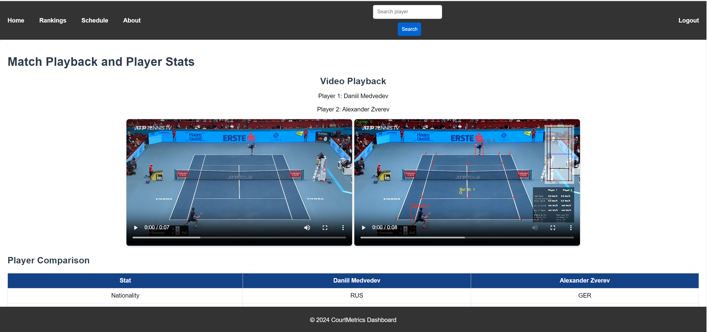

# Tennis OpenCV Video Analysis Application

## **Overview**
This application leverages OpenCV and deep learning models to analyze tennis match videos. Designed for researchers, analysts, and sports enthusiasts, it offers functionalities such as court detection, player tracking, and gameplay insights. By combining advanced machine learning algorithms and Azure cloud services, the application delivers real-time analytics to enhance understanding of tennis matches.

## Project Presentation

You can view the detailed project presentation [here](final_presentation_ppt.pptx).

---

## Project Video

Below is a walkthrough video demonstrating the project:

[](final_presentation_video.mp4)

*Click on the image above to watch the video.*


### **Key Highlights**
- **Objective**: Enhance tennis video analysis using deep learning models for player actions, ball tracking, and court keypoints detection to provide comprehensive match insights.
- **Features**:
  - **Ball and Player Tracking**: Successfully integrated tracking mechanisms for both ball movement and player actions.
  - **Court Keypoints Detection**: Developed a mini-court overlay for better visualization of gameplay.
  - **Player Action Detection**: Completed detection and classification of key player actions (e.g., backhand, forehand, serve).
  - **Player Statistics Analysis**: Integrated ATP data for player comparisons and utilized Azure OpenAI Services for advanced analysis.
- **Deployment**: The application is deployed using Azure Virtual Machines and Azure OpenAI services, ensuring scalability and real-time performance.


### **Dataset Details**
1. **Primary Dataset**:
   - **Size**: 8,841 images (75% training, 25% validation).
   - **Resolution**: 1280 × 720.
   - **Content**: Videos of matches on hard, clay, and grass courts.
   - **Source**: Extracted semi-automatically from YouTube highlights.
   - **Link**: [Dataset Link](https://drive.google.com/file/d/1lhAaeQCmk2y440PmagA0KmIVBIysVMwu/view?usp=drive_link)

2. **Tennis Player Actions Dataset**:
   - **Size**: 500 images per action category.
   - **Categories**: Backhand, forehand, ready position, and serve.
   - **Annotations**: COCO-format pose annotations for keypoints.
   - **Source**: Mendeley Data.
   - **Link**: [Dataset Link](https://data.mendeley.com/datasets/nv3rpsxhhk/1)

### **Tools and Technologies**
- **Frontend**: HTML, CSS, JS.
- **Backend**: Flask, PostgreSQL, Python, Azure OpenAI.
- **Machine Learning Models**:
  - YOLOv8 for ball and player detection.
  - TrackNet CNN for tennis court detection.
  - ResNet-18 for player action detection.
- **Azure Services**:
  - Azure Virtual Machines.
  - Azure Virtual Network and Resource Groups.
  - Azure OpenAI.
- **Visualization Tools**: Matplotlib, Seaborn.
- **Other**: Trello, Jira, Kanban for project management.

---

## **File Structure**
- **analysis/**: Scripts for analyzing tennis match data
- **constants/**: Stores constant values used throughout the app
- **court_line_detector/**: Court line detection algorithms and helpers
- **data/**: Dataset files or external input data
- **mini_court/**: Mini tennis court representation logic
- **models/**: Machine learning and deep learning models
- **models1/**: Pre-trained model files
- **static/**: Static assets like images, videos, and CSS
- **templates/**: HTML templates for the Flask app
- **tracker_stubs/**: Tracking utility stubs
- **trackers/**: Tracking algorithms
- **training/**: Scripts and data for model training
- **utils/**: Utility functions
- **app.py**: Main Flask application file
- **main.py**: Entry script for running the application
- **player_data.json**: Sample JSON data for players
- **PVP.py**: Player vs Player analysis script
- **raw_response.json**: Raw response for debugging API
- **README.md**: Documentation
- **requirements.txt**: Dependencies for the project
- **runbook.txt**: Instructions for deployment and setup
- **yolov8x.pt**: YOLOv8 model weights

---

### **Deployment Details**

The deployed application for the project can be accessed at the following link:

[Deployed Application](http://capstone-project-group8.westus2.cloudapp.azure.com:5000/)

#### **Important Notes:**
- The version deployed at the above link is an **older version** of the application.
- We are currently unable to deploy the updated version of the application due to network issues and resource connectivity problems with the Azure cloud environment.

#### **Challenges with Deployment:**
- The existing Azure resources are not connecting properly, and we are unable to perform incremental updates or fixes.
- Redeploying the updated version would require creating new instances and services from scratch, which is a time-intensive process.
- Given the limited time available before submission, we are focusing on ensuring the updated application runs successfully in the **local environment**.

#### **Current Status:**
- The latest version of the application, with all bug fixes and updates, is fully functional when run locally.
- We aim to demonstrate the updated functionality using the local environment while maintaining the older version for reference in the cloud.

This approach ensures that all project requirements are met within the given constraints.


## **How to Run the Application**

## **Steps to Run the Application**

### 1. **Set Up the Virtual Environment**
Create and activate a virtual environment to manage dependencies.
# Create the virtual environment
```bash
python3 -m venv myenv
```
# Activate the virtual environment (Linux/MacOS)
```bash
source myenv/bin/activate
```

# Activate the virtual environment (Windows)
```bash
myenv\Scripts\activate
```
### 2. **Install Dependencies**
Install the required libraries and dependencies listed in requirements.txt.
```bash
pip install -r requirements.txt
```
### 3. **Set Up the Database**
Initialize and migrate the database for storing user and gameplay data.
Initialize the Database

```bash
flask db init
```

Create the Migration Script
```bash
flask db migrate -m "Initial migration"
```

```bash
flask db revision -m "Add users table"

#copy this code in migrations folder under versions initial_migration.py
op.create_table(
    'users',
    sa.Column('id', sa.Integer, primary_key=True),
    sa.Column('name', sa.String(length=150), nullable=False),
    sa.Column('email', sa.String(length=150), nullable=False, unique=True),
    sa.Column('password_hash', sa.String(length=200)),
    sa.Column('created_at', sa.DateTime, nullable=True),
)

```

Apply the Migrations
```bash
flask db upgrade
```

### 4. **Run the Application**
Start the Flask application to serve it locally.
Start the Application
```bash
python app.py
```
Access the Application
Open your browser and navigate to:
```bash
http://127.0.0.1:5000/
```

you can create a user if all the db migrations is complete and  view the application.

---

## **Brief Product Description**
The Tennis OpenCV Video Analysis Application is a tool designed to analyze tennis matches by detecting courts, tracking players, and extracting gameplay insights. Using advanced deep learning models like YOLOv8 and OpenCV, the app processes video footage to generate real-time or batch analytics for better performance evaluation and gameplay strategy.

---

## **Product Functionalities**
### Features:
- **Court Detection**: Identifies the boundaries and centerlines of the tennis court.
- **Player Tracking**: Tracks the movement of players during the match.
- **Video Analysis**: Extracts key gameplay metrics such as ball speed, player positioning, and shot patterns.
- **Data Visualization**: Presents insights using dynamic visualizations.

### Screenshots
## Screenshots

### Home Page


### Login Page


### Register Page


### About Page


### Search Page


### Schedule Page


### Rankings Page


### Player Overview and Career Highlights


### Player Metrics


### Performance Statistics and Tournament History


### Head-to-Head


### Historical Trends and Comparison Visualizations


### Comparison Visualizations


### Court Metrics Dashboard


### After Clicking Upload



---

## **Design**
### **Backend**
- The application is built using **Flask**, a lightweight web framework, which serves as the backbone for routing and API integrations.
- **PostgreSQL** is used as the database to store user information, match statistics, and gameplay data.
- The backend integrates **Azure OpenAI** for generating detailed player analysis and statistics summaries.

### **Computer Vision and Machine Learning**
- **YOLOv8**:
  - Used for real-time detection of players and the ball.
  - Provides accurate bounding boxes for dynamic tracking during matches.
- **TrackNet CNN**:
  - Specialized for detecting and analyzing court keypoints.
  - Generates mini-court overlays for enhanced visualization of gameplay.
- **ResNet-18**:
  - Adapted for player action recognition, including forehand, backhand, serve, and ready positions.
  - Utilizes transfer learning for robust classification on the custom dataset.

### **Frontend**
- Built with **HTML**, **CSS**, and **JavaScript** to ensure an intuitive and responsive user interface.
- Dynamic dashboards for visualizing gameplay data and court keypoints.

---

## **API Endpoints**

### 1. **User Authentication APIs**

#### **`/login`** (GET/POST)
- **Purpose**: Handles user login functionality.
- **Description**: Accepts user email and password via a form, verifies credentials using the database, and logs the user in. Redirects to the home page upon success.
- **Design Details**:
  - Uses Flask-Login for session management.
  - Hashes passwords for security using `check_password_hash`.

#### **`/register`** (GET/POST)
- **Purpose**: Handles user registration.
- **Description**: Allows new users to register by providing their name, email, and password. Stores hashed passwords in the database.
- **Design Details**:
  - Ensures email uniqueness using database checks.
  - Validates user inputs and provides feedback for errors.

#### **`/logout`** (GET)
- **Purpose**: Logs out the current user.
- **Description**: Ends the user session and redirects to the login page.
- **Design Details**:
  - Uses Flask-Login’s `logout_user` method for session management.

---

### 2. **Tennis-Specific APIs**

#### **`/rankings`** (GET)
- **Purpose**: Displays the ATP player rankings.
- **Description**: Fetches live ATP rankings from the Tennis API and renders them on the **rankings.html** page.
- **Design Details**:
  - Integrates the **RAPIDAPI Tennis API** to fetch player ranking data dynamically.
  - Displays key player details such as name, ranking, and points.

#### **`/schedule`** (GET)
- **Purpose**: Displays tennis event schedules.
- **Description**: Fetches data about upcoming tennis events and renders them on the **schedule.html** page.
- **Design Details**:
  - Uses the RAPIDAPI Tennis API to retrieve event data for a fixed date.
  - Displays match information, including player names, event type, and location.

#### **`/player_search`** (GET)
- **Purpose**: Searches for detailed information about a specific tennis player.
- **Description**: Accepts a query parameter (player name) and retrieves player details from the RAPIDAPI Tennis API.
- **Design Details**:
  - Returns player bio, statistics, and career highlights.
  - Provides error handling for invalid or missing player data.

---

### 3. **Video Processing APIs**

#### **`/upload`** (POST)
- **Purpose**: Handles video uploads for analysis.
- **Description**: Accepts video uploads or YouTube links for analysis. Extracts player data and generates video-based statistics.
- **Design Details**:
  - Processes videos using OpenCV and YOLOv8 for player and ball tracking.
  - Fetches player data using the GPT API for in-depth comparisons.
  - Saves videos and outputs dynamically for further analysis.

#### **`/play/<video_file>`** (GET)
- **Purpose**: Streams uploaded or processed videos.
- **Description**: Locates the video in the upload or YouTube folder and renders it on the **play.html** page.
- **Design Details**:
  - Dynamically generates the video path and embeds it in the UI.
  - Provides support for both local uploads and YouTube downloads.

---

### 4. **GPT Integration APIs**

#### **`fetch_gpt_player_data`** (Internal Function)
- **Purpose**: Fetches comparative player data from Azure OpenAI.
- **Description**: Generates a detailed JSON report comparing two players based on a predefined structured prompt.
- **Design Details**:
  - Uses the GPT API to create sections like Player Overview, Career Highlights, Head-to-Head Records, and Historical Trends.
  - Outputs data in strict JSON format, ensuring compatibility with frontend components.

---

### 5. **Static Pages**

#### **`/about`** (GET)
- **Purpose**: Provides information about the project and team.
- **Description**: Displays the **about.html** page with static project information.
- **Design Details**:
  - Serves as an informational page for users to understand the project goals and functionalities.

---

## **Unique Features**
1. **Custom Court Line Detection**:
   - A unique algorithm leveraging geometric transformations and computer vision techniques for accurate court line detection.
   - Ensures compatibility with various court types (e.g., hard, clay, grass).

2. **Player Tracking and Mini-Court Visualization**:
   - Tracks players dynamically and projects their positions onto a mini-court overlay for better understanding of movement patterns.

3. **Player Action Classification**:
   - Detects key actions (e.g., forehand, backhand, serve) with high accuracy using ResNet-18.
   - COCO-format annotations ensure precise keypoint detection for training the model.

4. **Scalable Deployment with Azure**:
   - Deployed on **Azure Virtual Machines** and utilizes **Azure OpenAI** for advanced analytics.
   - Ensures real-time analysis for live matches while maintaining scalability.

5. **Integration with ATP Data**:
   - Combines real-time match analysis with historical ATP data for comprehensive player performance comparison.

6. **Modular and Extendable Design**:
   - Built with modularity in mind, allowing easy integration of new models and functionalities without overhauling the core framework.

### **GPT Integration Features**

This application integrates **Azure OpenAI GPT** to generate in-depth comparative reports on tennis players. The following features are powered by GPT:

1. **Detailed Player Reports**:
   - Provides comprehensive player comparisons, including personal details, career highlights, performance statistics, and historical trends.
   - Information includes:
     - Player overviews such as nationality, playing style, and professional start year.
     - Career achievements like total titles, Grand Slam wins, and rankings.

2. **Customizable Report Generation**:
   - Dynamic prompts are used to fetch customized JSON-based reports based on user inputs (e.g., specific player names).
   - GPT is instructed to adhere to strict JSON formatting, ensuring compatibility with the application’s data handling pipelines.

3. **Key Report Sections**:
   - **Player Overview**: Personal and professional details like name, nationality, and playing style.
   - **Career Highlights**: Summarizes achievements, prize money, rankings, and Grand Slam wins.
   - **Head-to-Head Records**: Detailed breakdown of matches, wins, and surface-based statistics.
   - **Performance Statistics**: In-depth analysis of service and return stats, win percentages, and tiebreak records.
   - **Tournament History**: Historical performances across Grand Slams, ATP Finals, and Masters tournaments.
   - **Ranking Progression**: Year-wise timeline of rankings for each player.
   - **Historical Trends**: Longest win streaks, performance against top-10 players, and notable match upsets.

4. **Dynamic Query Handling**:
   - Automatically adjusts to fetch and format missing data as `null` or empty arrays, ensuring data integrity even when information is incomplete.

5. **JSON Compliance**:
   - Ensures all keys are formatted in camelCase, and values conform to strict JSON standards, ready for seamless integration into the application.

By utilizing GPT for this purpose, the application enables highly accurate, detailed, and dynamic analysis, elevating the user experience with instant access to comprehensive tennis player analytics.


### **Why It's Unique**
- Unlike traditional sports analysis tools, this application focuses specifically on tennis with tailored algorithms for court and action detection.
- The use of custom datasets and COCO annotations ensures robustness across various court types and gameplay conditions.
- Combines video analysis with Azure-powered AI to provide enriched insights, setting it apart from standard OpenCV-based tools.

---

## **Retrospection**
### What Went Well:
- Successful integration of YOLOv8 for player detection.
- Real-time analysis capabilities achieved using Flask.

### Challenges:
- Encountered deployment issues on the cloud due to resource constraints.
- Initial difficulties in handling diverse video resolutions and angles.

---

## **Recommendations for Future Improvements**
1. **Enhance Scalability**:
   - Optimize models for deployment on cloud platforms with limited resources.
2. **Additional Features**:
   - Add support for advanced match analytics, such as shot predictions and heatmaps.
3. **Mobile Compatibility**:
   - Create a mobile-friendly interface for broader accessibility.

---
